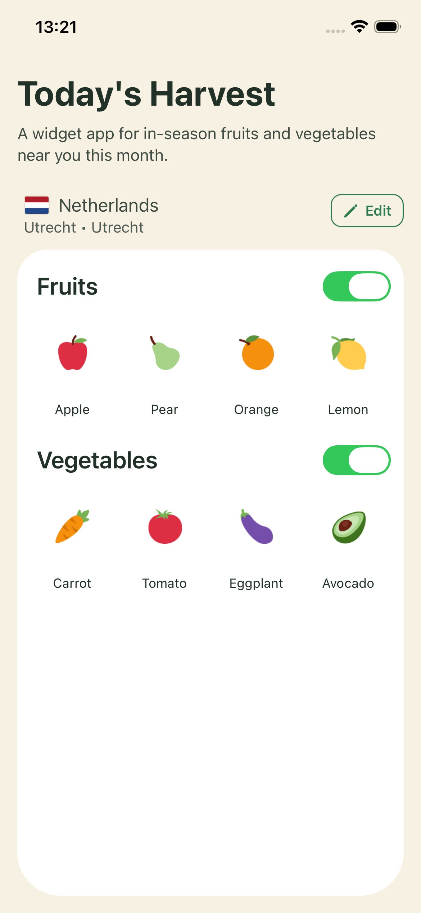
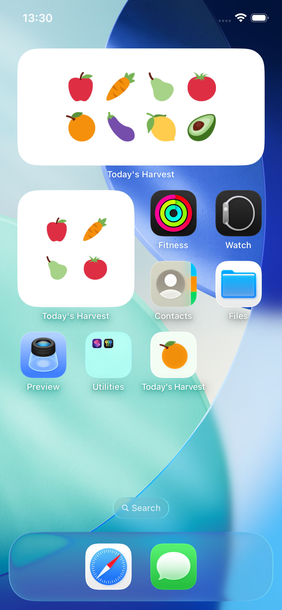

# Today's Harvest

Widget-first iOS app built with Expo + Convex. It shows produce emojis that are currently in season for the user's location and month.

## Screenshots

### App



### Widgets



## Stack

- Expo (React Native + TypeScript)
- Convex (database + server functions)
- OpenAI API (only used server-side from Convex actions)
- `expo-widgets` + `@expo/ui` for iOS widget extension

## Architecture

### Client flow

1. Ask location permission.
2. Resolve `countryCode` and optional `region` from reverse geocode.
3. Compute current month in device timezone.
4. Call Convex action `seasonal.getSeasonalItems` for `fruit`.
5. Render emojis in app and push compact payload to widget data.

### Backend flow

1. Build key: `countryCode:region:month:category`.
2. Read `seasonal_items_cache` by key.
3. If hit, return deterministic cached data.
4. If miss, call OpenAI in Convex action.
5. Validate + normalize against `produce_catalog`.
6. Persist cache + generation log.
7. Return cleaned payload.

### Widget guarantees

- Widget reads only cached payload (from app-synced data / Convex cache data path).
- Widget does not trigger fresh LLM generation.
- Fast fallback rendering if no data exists yet.

## Data model

Convex tables are defined in [`/Users/jan/Developer/todays-harvest/convex/schema.ts`](/Users/jan/Developer/todays-harvest/convex/schema.ts):

- `seasonal_items_cache`
- `produce_catalog`
- `generation_logs`

## Validation rules implemented

- `month` must be `1..12`
- `category` must be `fruit` or `vegetable`
- `countryCode` from LLM must match request
- dedupe by canonical produce name
- only catalog-backed emojis allowed
- discard confidence `< 0.6`
- normalize aliases to catalog canonical names
- clamp list to `4..8` (pads from catalog if model returns too few)

## Folder structure

- `convex/` backend schema, actions, queries, mutations, cron
- `shared/` shared TypeScript types
- `src/` Expo app source
- `widgets/` iOS widget extension source

## Setup

1. Install dependencies:

```bash
npm install
```

2. Initialize Convex + generate types:

```bash
npx convex dev
```

3. Configure environment:

- App runtime: set `EXPO_PUBLIC_CONVEX_URL`
- Convex runtime: set `OPENAI_API_KEY`

```bash
npx convex env set OPENAI_API_KEY your_key_here
```

4. Start Expo:

```bash
npm run start
```

5. Run iOS:

```bash
npm run ios
```

## Key endpoints

- `seasonal.getSeasonalItems` action: cache-first fetch + generate on miss
- `seasonal.getWidgetPayload` query: deterministic cache-only widget data
- `seasonal.setManualOverride` mutation: manual curation path
- `catalog.seedCatalog` mutation: inserts produce emoji catalog
- `seasonal.prefillSeasonalFruit` action + `convex/crons.ts`: daily cache prefill

## Notes

- Manual overrides use `source = manual` and bypass LLM generation.
- Prompt versioning is tracked via `promptVersion` on cache rows.
- The widget config in `app.json` targets iOS first.
# todays-harvest
